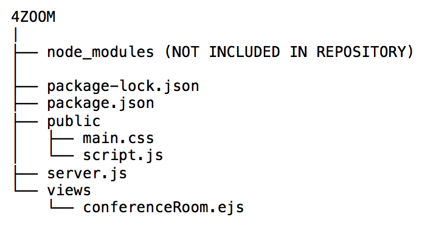

# 4ZOOM - Zoom's Clone

### Introduction
4Zoom is a real-time communication app that mimics Zoom's basic functions. 
This application allows 4 users at most, to connect in each chat/conference room.
The user gets prompted at the beginning of each session for a username. Videos and 
control buttons are located on the left side of the screen; the right section includes
a chat message board.

### Link
Heroku: https://four-zoom-by-juan.herokuapp.com

### How does it work?
Open the app (previous link), copy/paste the URL, and send it to another user! 
The app generates a unique chat room id (series of numbers, dashes and letters) 
whenever the link opens on a new tab. 
Please note that refreshing the page will NOT change the room id.
#### For example: https://four-zoom-by-juan.../85ebaaa5-64de-4ebc-aaad-d6f2cb9ab5e

### Does the code require a local web server to run?
Yes.

### Directory Tree

### Technologies
1. HTML5
2. CSS3
3. JavaScript:
   * ES6
4. jQuery
5. Node.js (Server-side)
6. NPM Modules:
   * Ejs
   * Express
   * Peer
   * Socket.io
   * UUID
